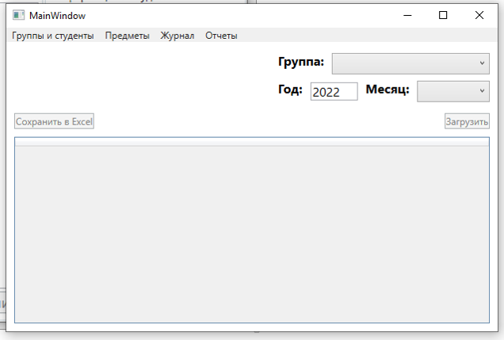
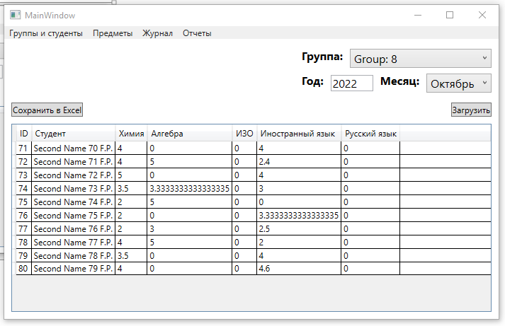
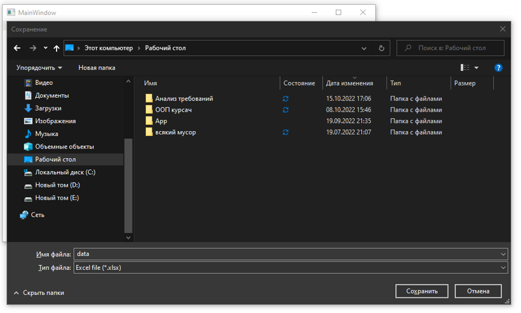

## **Средние оценки**

**19**. При выборе "Средние оценки по всем предметам для студентов из группы" из меню, содержимое главной формы изменится  
  
 
После указания группы, даты и месяца таблица заполнится средними оценками по всем изучаемым предметам в этой группе  
  
  

**20**. Эту таблицу можно сохранить в Excel  
  
  