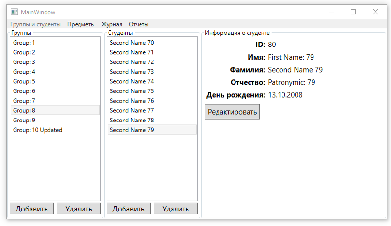

## **Группы и студенты**

**2**. (После закрытия приветственного диалогового окна), появится главная форма приложения  
  
 
Если выбрать какую-либо группу, то в поле '**Студенты**' отобразятся студенты этой группы. Выбирая кого-нибудь студента, в поле '**Информация о студенте**' отобразиться соответствующая информация  
  
  

**3**. Выбранного студента можно редактировать. Например, отредактируем студента из первой группы (**Group: 1**). Изменим его ФИО и переведем его в 10 группу (Group: 10 Updated)  
  
 
Из первой группы он исчезнет     
  
 
А в десятой группе появится  
  
  

**4**. Все поля для студента должны быть заполнены, иначе будет ошибка валидации  
  
  

**5**. Студентов можно создавать  
  
 
После создания, он появится в соответствующей группе  
  
  

**6**. Студентов можно удалять  
  
 
После подтверждения студент удалится и исчезнет из группы  
  
  

**7**. Можно создавать/редактировать группы  
  
 
После создания, группа появится на экране  
  
  

**8**. Группы можно удалять  
  
 
После подтверждения группа и студенты из этой группы будут удалены  
  
  