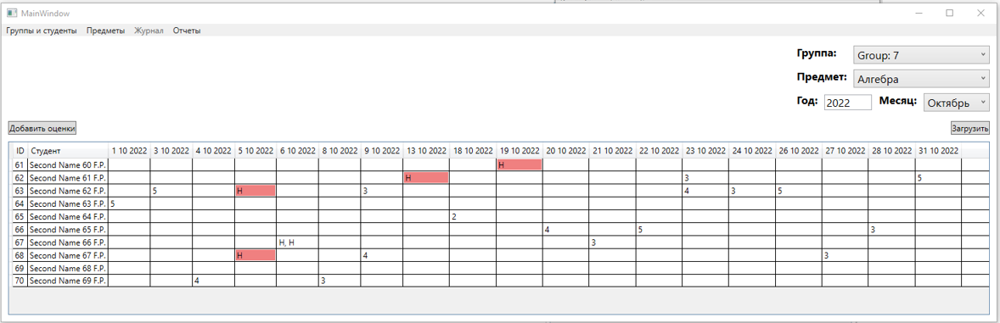

## **Журанал**

**15**. При выборе "Журанал" из меню, содержимое главной формы изменится  
  
  

**16**. При указании группы, предмета, года и месяца отобразятся оценки  
  
  

**17**. Можно добавлять оценки. На выбор будут только те даты, за которые не были выставлены оценки  
  
 
Ставить можно следующий оценки: 2, 3, 4, 5, н (не был)  
  
 
После добавления, оценки отобразяться в таблице  
  
  

**18**. Оценки можно редактировать (нажав 2 раза по нужной ячейки в таблице)  
  
 
После редактирования, изменения появятся в таблице  
  