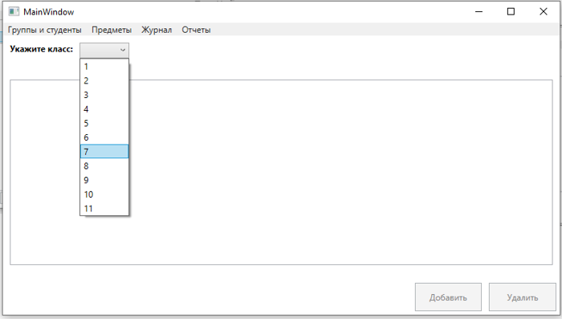
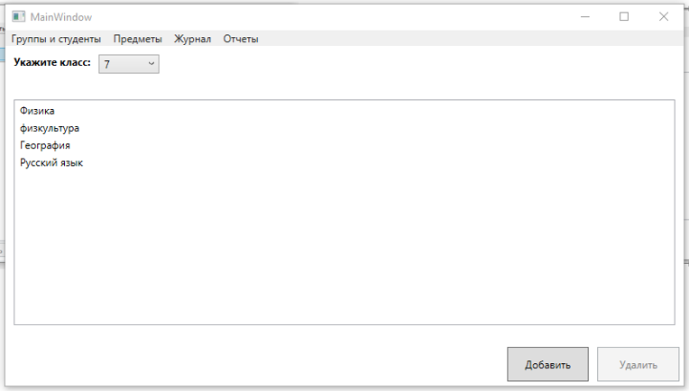
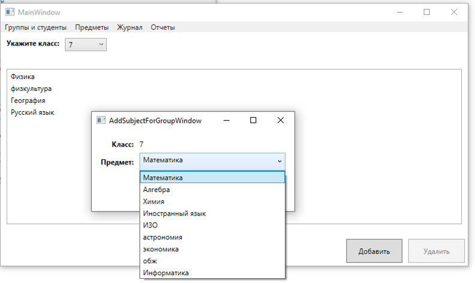
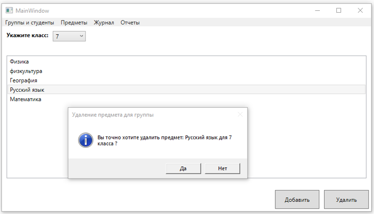
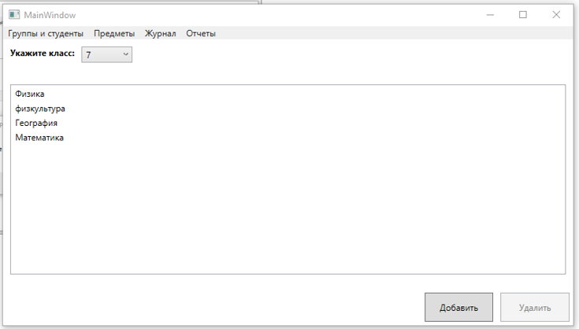
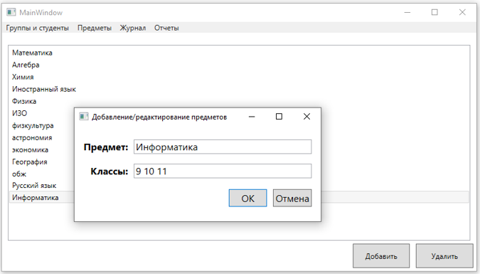
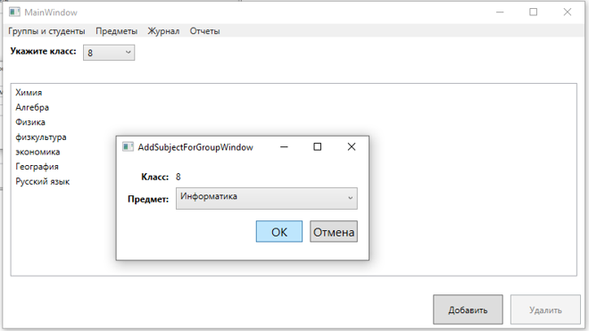
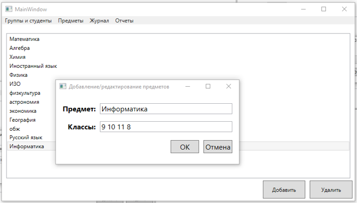
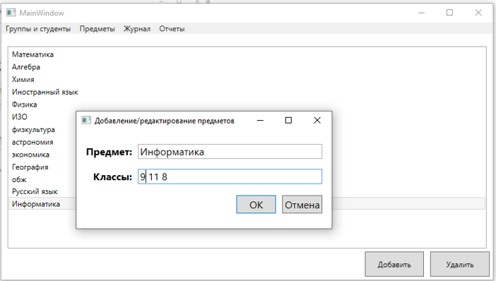
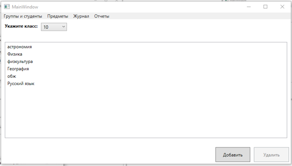

## **Предметы по группам**

**11**. При выборе "Предметы по группам" из меню, содержимое главной формы изменится  
  
 
Выберем например 7 класс и посмотрим какие предметы изучаются в этом классе  
  
  

**12**. Можно для указанного класса добавить предмет (Предмет выбирается из уже имеющихся в базе). Добавим например предмет "математика"  
  
 
  
  

**13**. Можно убрать изучаемые предметы для класса. Уберем например "русский язык"  
  
 
  
  

**14**. Рассмотрим следующий пример. Пусть у нас есть предмет "Информатика", который изучается в 9 10 11 классах  
  
 
Перейдем теперь на представление "Предметы по группам" и добавим "информатику" для 8 класса  
  
 
После этого динамически изменится информация о предмете "Информатика"  
  
 
Теперь удалим информатику для 10 класса, находясь на представлении "Все предметы"  
  
 
После этого мы увидим на представлении "Предметы по группам", что для 10 класса пропал предмет "Информатика"  
  
  