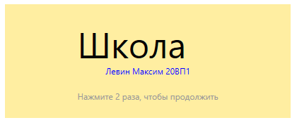
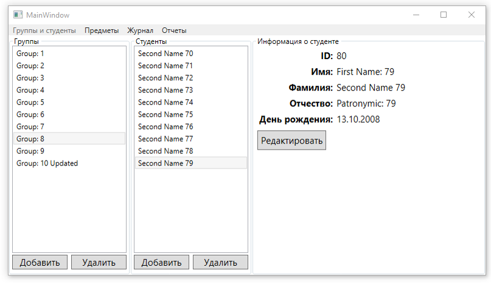
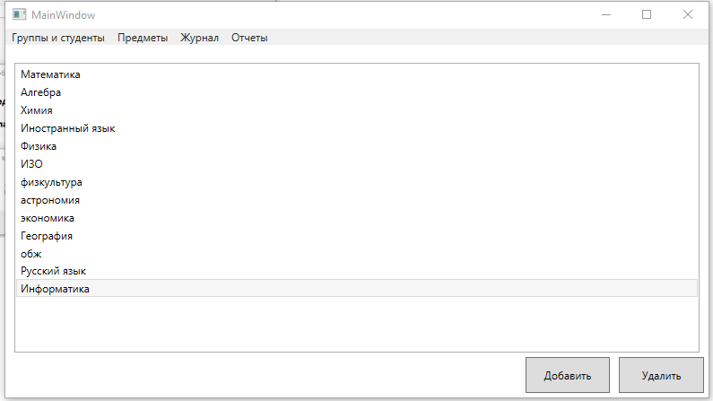
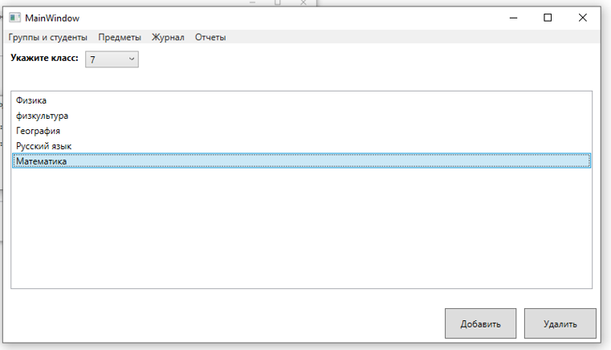
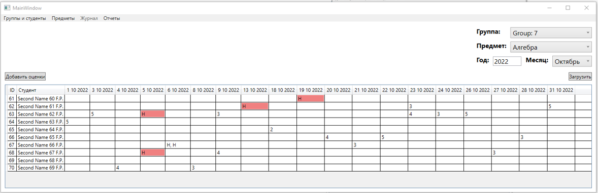
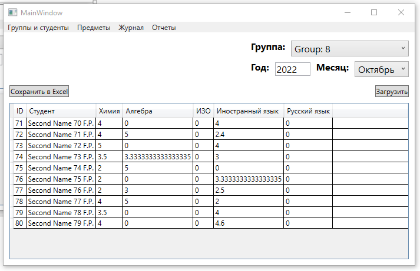

# ИС: Школа

## Используемые технологии и библиотеки
Проект создан на платформе ***.NET 6***, с использованием языка программирования ***C#*** и технология ***WPF***.  

Были использованы следующие **Nuget-пакеты:**  
- AutoMapper (12.0.0) - для проецирования одной модели на другую
- AutoMapper.Extensions.Microsoft.DependencyInjection (12.0.0) - для упрощения внедрения автомаппера в DI контейнер
- EPPlus (6.0.8) - для работы с Excel
- Microsoft.EntityFrameworkCore.Sqlite (6.0.10) - ORM с провайдером для SQLite 
- Microsoft.Extensions.Hosting (6.0.1) - нужен для того, чтобы был DI контейнер
- Microsoft.Xaml.Behaviors.Wpf (1.1.39) - для WPF, чтобы можно было использовать команды вместо обработчиков событий (MVVM)  

  

## Краткое описание UI приложения  
Приложение содержит одну главную форму и меню, расположенное вверху. В меню есть следующие элементы:
- "**Группы и студенты**" - отображает группы и студентов, а также инофрмацию по студенту
- "**Предметы**"
    - "**Все предметы**" - отображает все предметы
    - "**Предметы по группам**" - отображает предметы, изучаемые в выбранном классе
- "**Журнал**" - отобажает оценки
- "**Отчеты**"
    - "**Средние оценки по всем предметам для студентов из группы**" - отображает средние оценки для группы  

Выбирая какой-либо пункт меню, содержимое главной формы будет динамически изменяться

  

## Представления (Формы)  

1. Диалоговое окно приветствия  
  
    
2. Представление "Группы и студенты"  
  
[Более подробное пояснение](./Docs/descriptions/Groups_and_students.md)  
    
3. Представление "Все предметы"  
  
[Более подробное пояснение](./Docs/descriptions/All_subjects.md.md)  
    
4. Представление "Предметы по группам"  
  
[Более подробное пояснение](./Docs/descriptions/Subjects_for_group.md.md.md)  
    
5. Представление "Журнал"  
  
[Более подробное пояснение](./Docs/descriptions/Journal.md.md.md)  
    
6. Представление "Средние оценки по всем предметам для студентов из группы"  
  
[Более подробное пояснение](./Docs/descriptions/Avg_marks.md.md.md)  
    